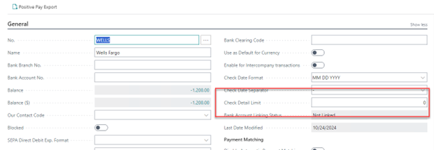
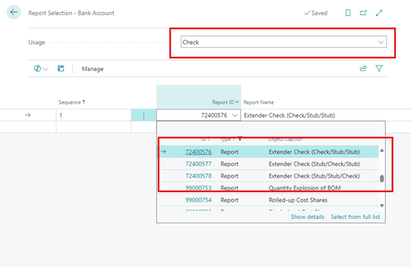
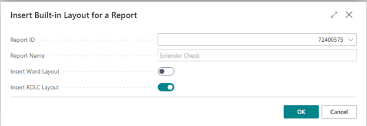
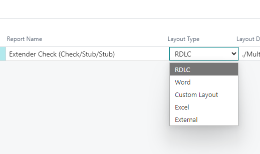

# Setting the number of check details that can print on a check

1. Navigate to the Bank Account page. This can be located using the search bar.
2. Choose the bank which the check will be printed from.  A new field will be available in the detail under the Check Date separator, entitled **Check Detail limit**.
   
3. Set the Check Detail Limit to the maximum number of details you want to print on a check before remittance is required.

# Choosing you appropriate check style

1. navigate to the Report Selection - Bank page.  This can be located using the search bar.
2. Select the **Check** usage option.
3. Choose one of the following options that matches your current check setup
   1. Report ID: 72400575 – Extender Check
   2. Report ID: 72400576 – Extender Check (Check/Stub/Stub)
   3. Report ID: 72400577 – Extender Check (Stub/Check/Stub)
   4. Report ID: 72400578 – Extender Check (Stub/Stub/Check)
      

# Importing a custom layout

1. Navigate to the Custom Report Layouts page,  This can be located using the search bar.
2. Create a new layout and target the report ID you chose in the previous step.  Choose **Insert RDLC Layout**.
   
3. To download a copy of the check layout, select Home -> Layout -> Export Layout.
4. To replace the layout with a new copy, select Home -> Layout -> Import Layout.
5. Once your change are complete, navigate to Report Layout Slection,  This can be located using the search bar.
6. Locate the report ID in the list and change the **Layout Type** to **Custom Layout**
7. You will need to enter a new layout.  Choose the layout created in the previous step.
   

Upon completing this step, your check setup will be finalized, and the printed checks will adopt your new format. If the check details surpass the Bank Account setup limit (or a default value of 10), a remittance message will be printed, followed by the remittance advice for the check.